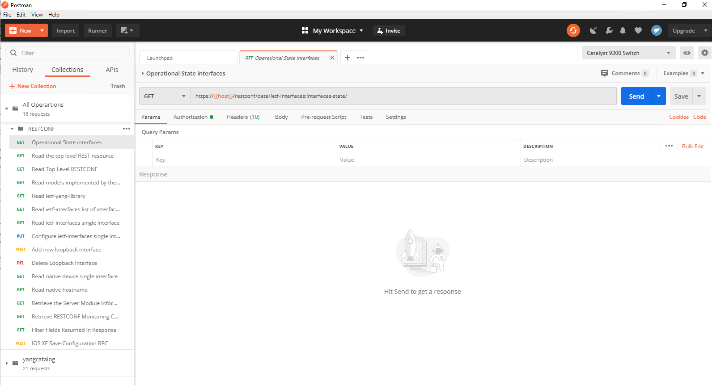

## Cisco IOS XE - Postman collections

This public repo contains a POSTMAN environment and collection that can be used to interact with the [IOS XE on CSR Latest Code Always On Sandbox](https://devnetsandbox.cisco.com/RM/Diagram/Index/38ded1f0-16ce-43f2-8df5-43a40ebf752e?diagramType=Topology). The IOS XE on CSR Latest Code Always On Sandbox offers developers shared, VPNless access to an IOS XE device running the latest IOS XE code release available on cisco.com. Here you can test out the newest programmability features and data models available

The environment is pre-configured to access the IOS XE on CSR Latest Code Always On Sandbox.Postman collection for Cisco IOS XE RESTCONF + YANG Model Driven Programmability interface (API) 

You can edit the variables in the environment to point to your own IOS XE device.  Feel free to modify them as you see fit and to add more calls to the collection.

## Setup

If you don't have Postman already installed, you can download it from [here](https://getpostman.com/). Once you install it, you can follow the steps below to import the collection and environment.

- Click on Import, browse to the location where you cloned this repo and add the two files:
- ios_xe_always_on.postman_environment.json
- cisco_ios_xe_17_2_collection.json
- cisco_ios_xe_yangcatalog_collection.json
- Make sure you select the IOS XE DevNet Sandbox RESTCONF Always On
- Expand the collection and start making RESTCONF API calls

**Note:** In case your instance has a self signed certificate, make sure you disable SSL certificate verification in Postman's settings. To disable SSL certificate verification go to Settings, click on switcher as in the screenshot below

